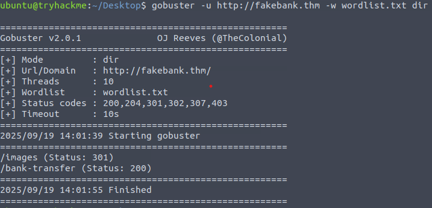
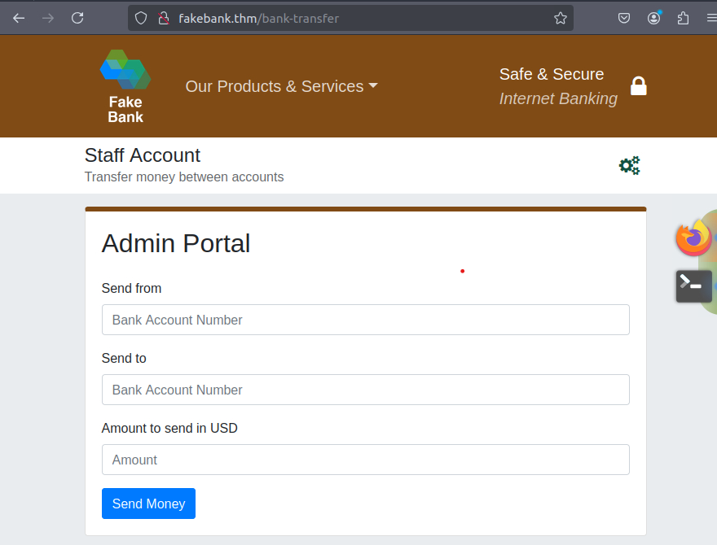
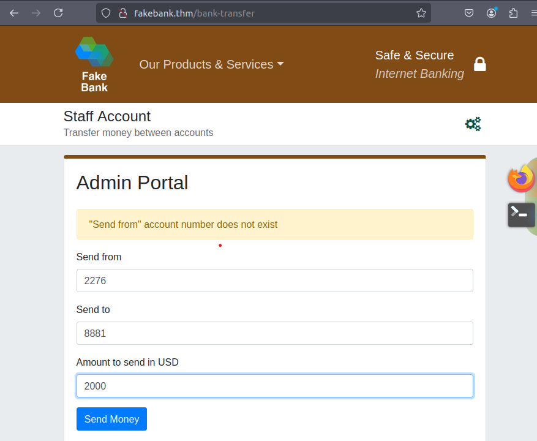
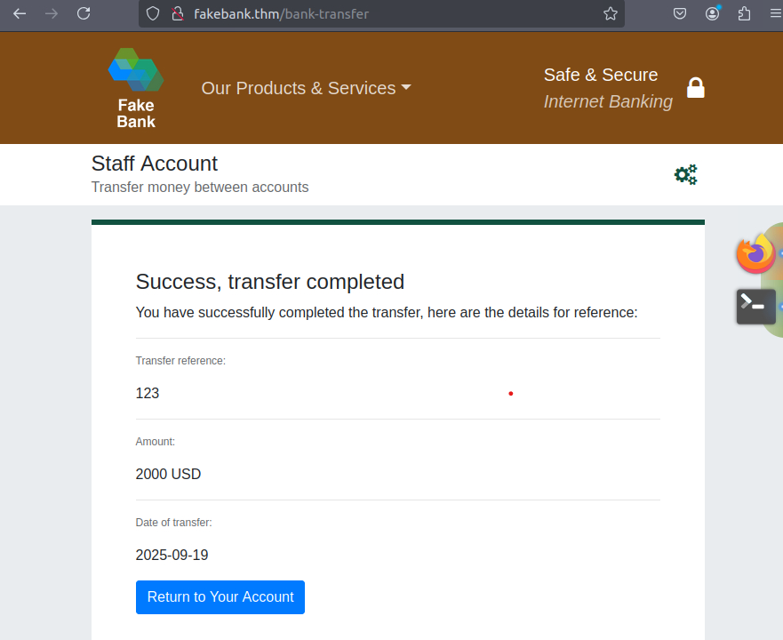
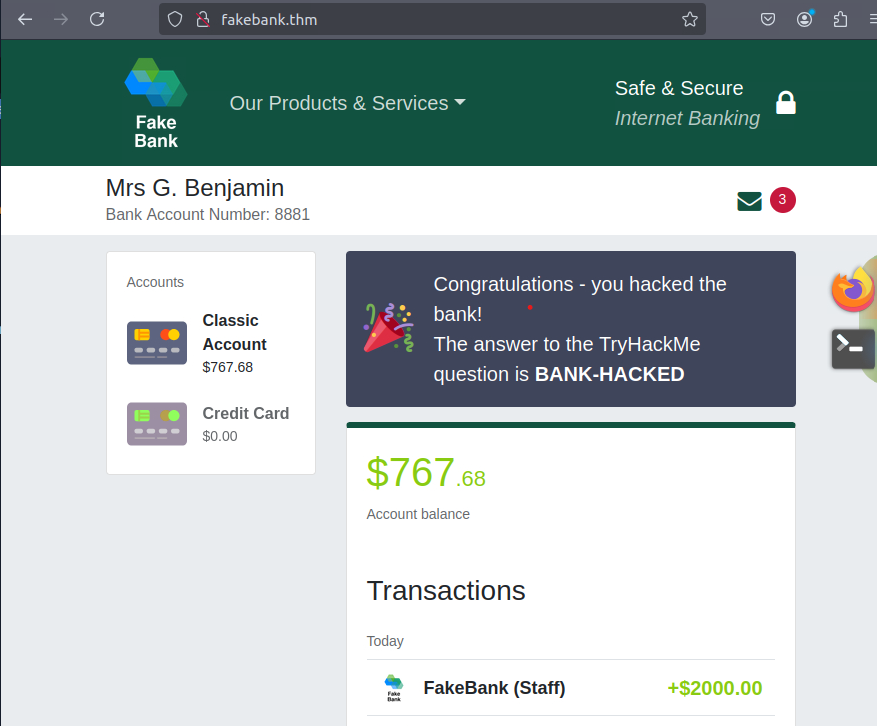

# What is Offensice Security
https://tryhackme.com/room/offensivesecurityintro


"To outsmart a hacker, you need to think like one"

The core of "Offensive Security" involve breaking into systems, exploiting bugs, loophole and gain unauthorized acces.

---
## Hacking Your First Machine

### Exercice : Brute force FakeBank's Website to find directories and pages.

- For this, we will use the tool **GoBuster** : This take a list of potential page or directory names and try accessing a website with each of them. If the page exists, it is telling you

- To use GoBuster type this command ```gobuster -u http://fakebank.thm -w wordlist.txt dir``` the **-u** its to state the website we are scanning and **-w** define the list of word it will use to iterate through 


- We can see the **/bank-transfer** adress with a Status 200, that means it found this adress and its accessible. If we go with a navigator to this page we see this :


- At this point our role as a PenTester is to report this vulnerability to the client before a hacker exploit them.

- But, lets see what we can do on this pag, we clearly can transfer 2000$ from an account to one of our.




---
## Carrers in Cyber Security

To Become an InfoSec, you ave to break down and learn area you are interested in and then regularly practice using hands-on exercice.